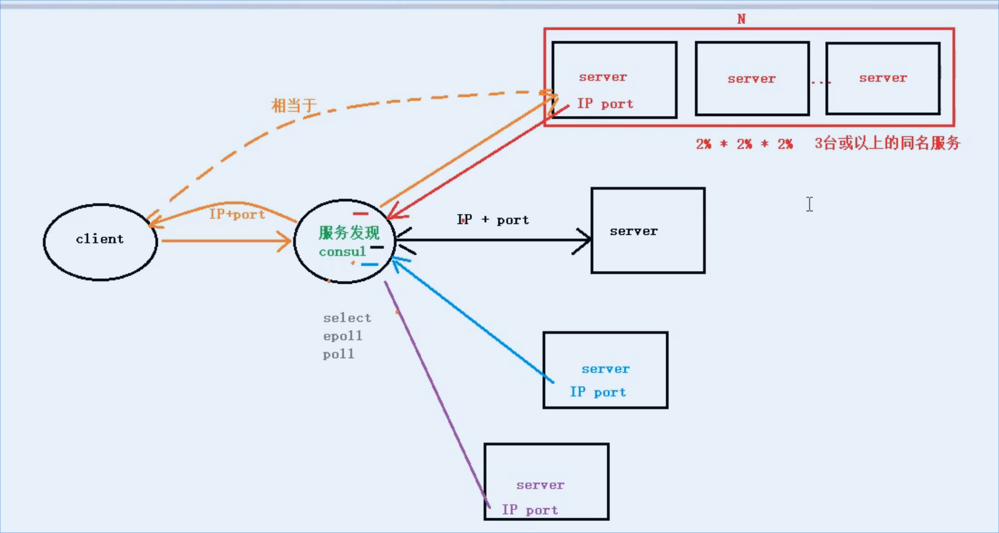

# micro

## micro 简介

* github.com/micro
  * go-micro: 核心库
  * micro: 运行环境、命令、创建微服务空项目
  * go-plugins: 微服务插件
  * examples: 案例
  * protoc-gen-micro: 生成micro代码

## 服务发现

* 微服务开发的核心

### 有服务发现后，client、server工作流程

1. 每个server启动是，将自己的ip、port注册和服务名注册给“服务发现”
2. 当client西哪个服务发现发起服务请求时，“服务发现”会自动找一个可用的服务，将其ip/port/服务名返回给client
3. client 再借助服务发现，访问server

### 服务发现种类

* consul: 常被用于go-micro中
* mdns: go-micro中默认自带的服务发现
* etcd: k8s内嵌的服务发现
* zookeeper: java中比较常用

### consul关键特性

1. 服务发现: 服务端主动向consul发起注册
2. 健康检查: 定时发送消息，类似于"心跳包"
3. 键值存储: consul提供，但是一般用redis
4. 多数据中心: 可以轻松搭建集群
